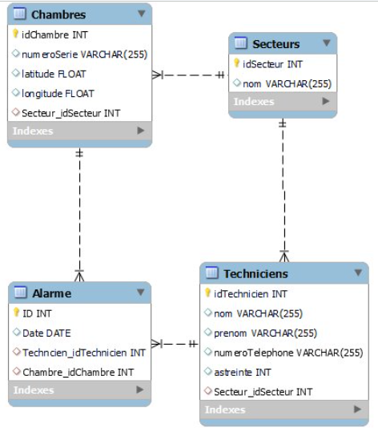

# 📚 Projet BTS SNIR - Gestion des Techniciens et Chambres

Ce projet a été réalisé dans le cadre de mes études de **BTS Systèmes Numériques, option Informatique et Réseaux (SNIR)**. L'objectif de ce projet était de concevoir et développer une application de gestion pour deux entités principales : les **Techniciens** et les **Chambres**.

Le projet inclut un système **CRUD** (Create, Read, Update, Delete) pour gérer ces deux tables dans une base de données relationnelle. Il a été réalisé en **C#** avec le framework **.NET MAUI**, permettant de développer des applications natives pour Windows.

---

## 🛠️ Fonctionnalités du projet

Le projet permet de gérer les informations suivantes :

### 🧑‍🔧 Table **Technicien**
- Ajouter, modifier et supprimer des techniciens.
- Afficher la liste des techniciens enregistrés.
- Chaque technicien a des informations comme : **nom**, **prénom**, **rôle**, **statut**, etc.

### 🏨 Table **Chambre**
- Ajouter, modifier et supprimer des chambres.
- Afficher la liste des chambres.
- Chaque chambre possède des informations comme : **numéro de chambre**, **statut** (disponible, occupée), **type de chambre**, etc.

### 🔄 Fonctionnalités **CRUD**
Les fonctionnalités de gestion des techniciens et des chambres incluent :
- **Création** : Ajouter de nouveaux techniciens et chambres.
- **Lecture** : Consulter les informations des techniciens et chambres existants.
- **Mise à jour** : Modifier les informations des techniciens et chambres.
- **Suppression** : Supprimer des techniciens et chambres de la base de données.

---

## 🏗️ Architecture

L'application suit l'architecture **MVVM** (Model-View-ViewModel), garantissant une séparation claire entre la logique métier, l'interface utilisateur et les données. Cette architecture facilite la gestion et l'évolution du projet.

---

## ⚙️ État du projet

Le projet est encore en développement et n'a pas été terminé à temps pour sa date de soumission. Plusieurs fonctionnalités ont été mises en place, mais il reste des aspects à finaliser.

Les fonctionnalités de base pour la gestion des techniciens et des chambres sont fonctionnelles et l'intégrité des données est garantie. Les tests unitaires relatifs à la base de données ont été réalisés et sont fonctionnels.

Certaines fonctionnalités qui auraient dû être incluses, comme une **map interactive** 🗺️ et l'**envoi de SMS** 📱, n'ont pas été réalisées car elles ne faisaient pas partie de ma tâche initiale.

---

## 💻 Technologies utilisées

- **C#** avec **.NET MAUI** pour le développement de l'application Windows.
- **SQLite** ou une autre base de données relationnelle pour la gestion des données.
- **XAML** pour la conception de l'interface utilisateur.

---

## 📦 Installation

### Prérequis

- **Visual Studio 2022** avec le support pour **.NET MAUI**.
- **.NET SDK** (version 6.x ou supérieure).
- **Windows 10/11** pour exécuter l'application.

### Étapes d'installation

1. Clonez ce repository sur votre machine locale :
   ``git clone https://github.com/votre-utilisateur/nom-du-repository.git``

2. Ouvrez le projet dans **Visual Studio 2022**.

3. Assurez-vous d'avoir installé le **.NET SDK** et le support **.NET MAUI** dans Visual Studio.

4. Construisez et exécutez le projet pour tester l'application.

5. Si vous souhaitez connecter l'application à une base de données locale, assurez-vous que les tables `Techniciens` et `Chambres` sont créées dans votre base de données.

---

## 🗂️ Structure des Tables

Voici une capture d'écran représentant la structure de la base de données et des tables : 

---

## ✅ À faire / Travaux à terminer

- **Documentation complète** 📑 : Ajouter une documentation détaillée pour aider à l'installation et à l'utilisation du projet.
- **Fonctionnalités manquantes** 🚧 : Ajouter des fonctionnalités avancées comme la **map interactive** 🗺️ et l'**envoi de SMS** 📱 si nécessaire.

---

## 📞 Contact

Pour toute question ou pour contribuer au projet, vous pouvez me contacter à l'adresse suivante :  
[mon adresse email](mailto:goulois.lukas@gmail.com).

---

**Note** : Ce projet est un travail académique réalisé dans le cadre de mes études et n'a pas été terminé dans le temps imparti. Il reste une base de travail et peut être amélioré. Toute contribution est la bienvenue ! 🎉

---
